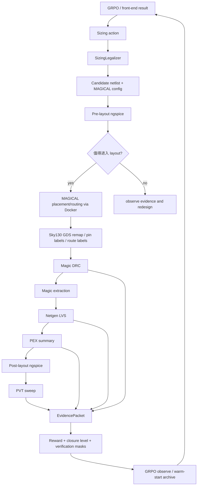
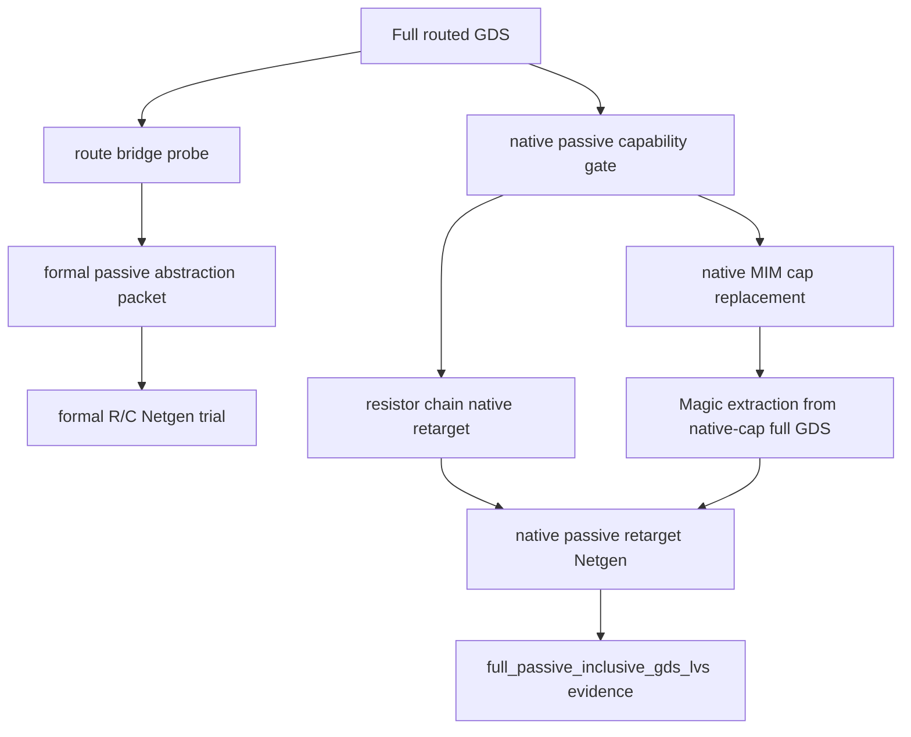

# MAGICAL Sky130 Analog Harness 技术报告

生成日期：2026-06-19  
项目路径：`E:\codex-magical-sky130-harness\magical-sky130-harness`  
外部依赖路径：`E:\codex-magical-sky130-harness\Analoggym_opt_moo_Mahalanobis_paper`

## 1. 一页摘要

这个项目的目标不是单独跑一次 MAGICAL，也不是单独训练一个模拟电路优化器，而是把“模拟电路 sizing 优化”和“Sky130 版图验证”接成一个可以反复迭代的闭环 harness。

所谓 harness，可以理解为一个工程化调度层：

- 上游接收优化器给出的器件尺寸。
- 中间把尺寸合法化并写成候选电路的 netlist、MAGICAL 配置、仿真 testbench。
- 下游调用 ngspice、MAGICAL、Magic、Netgen 等工具。
- 最后把性能仿真、DRC、LVS、PEX、post-layout 仿真等结果统一成 evidence packet。
- evidence packet 再反馈给 GRPO 优化器，下一轮 sizing 可以基于真实版图验证结果调整。

首个闭环对象是 `SMCNR_SE_2st_AMP`，即一个 Sky130 两级单端输出放大器案例。当前项目已经形成如下状态：

- GRPO 已作为 sizing optimizer 接入 harness。
- SMC design contract 已配置，包括端口、供电、性能指标、sizing 参数范围、legalizer、MAGICAL pipeline 路径。
- pre-layout ngspice、MAGICAL/Sky130 layout、Magic DRC、Netgen LVS、Magic extraction、post-layout ngspice、PVT sweep 已接成候选生命周期。
- harness 可以通过 CLI 执行 `run`、`resume`、`summarize`、`train-grpo`。
- 当前 best candidate 为 `cand_0031`，顶层 summary 显示 `best_closure_level=L6_post_layout_pvt`。
- passive-aware 方向也已经从 MOS-only projection 进一步推进：segmented resistor chain 和 `cfmom_2t` 电容都有可验证的 native/full-GDS evidence。
- WSL 中 `netgen-lvs` 已可用，Magic 也可用。

需要注意一个边界：顶层配置文件中仍保留原始默认字段 `verification.scope=mos_only_projection`，但当前 best passive evidence 已经记录为 `best_passive_aware_scope=full_passive_inclusive_gds_lvs`。也就是说，配置默认值还需要后续清理，但生成的 best evidence 已经能区分 MOS-only、formal passive abstraction、native passive inclusive GDS proof。

## 2. 背景：为什么需要 Analog Harness

模拟电路自动设计不能只看 schematic-level 性能。一个 sizing 在前仿中表现很好，并不代表它能：

- 被版图工具成功 placement/routing；
- 通过 DRC；
- 通过 LVS；
- 在 PEX 后仍满足增益、带宽、相位裕度、功耗、settling 等指标；
- 在 PVT corners 下保持稳定。

传统优化器往往只处理前仿目标函数，例如最大化 gain、GBW、phase margin，或最小化 power、area。这样得到的 sizing 很容易在进入 layout 阶段后失效。Analog Harness 的核心思想是把“版图可闭合性”和“物理验证结果”也纳入优化反馈。

因此本项目把流程拆成几个层次：

- optimizer 负责提出 sizing action；
- legalizer 负责把 action 映射为合法器件参数；
- simulator 负责多保真性能评估；
- layout adapter 负责调用真实 Sky130/MAGICAL 版图流程；
- parser 负责把 DRC/LVS/PEX 等工具输出转换成结构化证据；
- controller 负责调度 candidate 生命周期、记录状态、生成 redesign request；
- archive 负责沉淀 warm-start 数据，供后续 GRPO 长训练使用。

这个设计的重点不是“一次跑通”，而是形成可恢复、可记录、可反馈的闭环。

## 3. 当前项目结构

核心新增代码位于：

```text
tools/analog_harness/
```

主要模块如下：

| 文件 | 作用 |
|---|---|
| `cli.py` | 命令行入口，支持 `run`、`resume`、`summarize`、`train-grpo` |
| `controller.py` | 顶层闭环调度器，管理 candidate 生命周期、evidence、summary、redesign request |
| `config.py` | 读取 YAML design contract，解析路径、端口、性能目标、工具配置 |
| `legalizer.py` | 将 optimizer action 映射为合法 W/L/multi/nf/被动器件参数 |
| `optimizer.py` | `SizingOptimizerAdapter` 接口和 `AnalogGymGRPOAdapter` 实现 |
| `frontend.py` | 复用已有 front-end sizing 结果，减少重复探索 |
| `spice.py` | 改写 SPICE 参数，生成 candidate netlist |
| `sim.py` | 基于 AnalogGym amp 模板生成 ngspice testbench，提取性能指标 |
| `layout.py` | 包装现有 Sky130/MAGICAL pipeline，解析 DRC/LVS/PEX/passive evidence |
| `state.py` | 持久化 candidate state 和 evidence JSONL |
| `archive.py` | 保存 GRPO warm-start bank 和 feedback dataset |
| `models.py` | `CandidateProposal`、`CompiledCandidate`、`EvidencePacket` 数据结构 |

SMC harness 配置位于：

```text
tools/analog_harness/configs/smcnr_se_2st_amp.yaml
```

Sky130 版图适配层位于：

```text
tools/sky130_adapter/
```

关键新增/使用的 Sky130 adapter 工具包括：

| 文件 | 作用 |
|---|---|
| `run_sky130_case_pipeline.py` | 现有 Sky130/MAGICAL case pipeline 的 Python 入口 |
| `prepare_native_passive_retarget_lvs.py` | 生成 native passive retarget LVS netlist 并运行 Netgen |
| `replace_native_cap_in_flat_gds.py` | 在 flattened full GDS 中替换 MOM cap 区域为 Sky130 native MIM cap，并做 terminal bridge |
| `prepare_sky130_native_cap_replacement.py` | 生成 Sky130 native capacitor replacement candidate |
| `add_mos_route_bridges_to_gds.py` | 根据 MOS split-net evidence 插入物理 route bridge |
| `add_net_labels_from_gr_to_gds.py` | 从 MAGICAL `.gr` route 信息恢复 net labels |
| `analyze_passive_abstraction.py` | 分析 passive extraction 与 source passive 的映射关系 |
| `verify_passive_abstraction_packet.py` | 校验 formal passive abstraction packet |
| `verify_passive_lvs_evidence.py` | 校验 passive LVS evidence 的完整性 |

生成数据和 evidence 位于：

```text
generated/analog_harness/smcnr_se_2st_amp/
```

当前顶层 summary：

```text
generated/analog_harness/smcnr_se_2st_amp/summary.json
```

passive 关键证据：

```text
generated/analog_harness/smcnr_se_2st_amp/cand_0031/layout_passive_existing_gds/resistor_remap_variants/native_cap_full_gds_trial/native_cap_full_gds_trial_summary.json
```

## 4. 整体 Harness 思想

Analog Harness 的核心抽象是“候选解 + evidence”。优化器不直接和工具日志交互，而是通过统一的数据结构读写：

- candidate proposal：优化器提出的 sizing action。
- compiled candidate：已经写好 netlist、配置、testbench、运行目录的候选。
- evidence packet：某个验证阶段的结构化结果。
- candidate state：聚合一个 candidate 的所有 evidence、reward、closure level、失败原因。
- summary：跨 candidate 的当前最优结果。

这种设计有几个好处：

1. 工具解耦  
   GRPO 不需要知道 Magic DRC log 怎么解析，也不需要知道 Netgen report 的格式。它只需要看到 reward、verification mask、closure level、失败原因等统一字段。

2. 可恢复  
   每个 candidate 都有自己的目录和 `state.json`，全局还有 `evidence/events.jsonl`。中断后可以 `resume`，不用重新跑所有阶段。

3. 可解释  
   每个 pass/fail 都有对应 artifact，例如 DRC log、Netgen report、PEX summary、仿真输出、passive abstraction packet。

4. 可分层闭环  
   不是所有 candidate 都必须跑最贵的 layout/PEX/PVT。可以先用 E0 前仿筛选，再把高分或不确定 candidate 推到 E2/E3/E4。

5. 可持续训练  
   好的 candidate 会被写入 warm-start bank 和 proxy feedback dataset，后续 GRPO 训练可以复用真实验证经验。

## 5. 闭环数据流

完整数据流如下：



其中 layout 之后还并行记录 passive-aware diagnostic/proof：



## 6. Candidate 生命周期

一个 candidate 的生命周期大致如下：

1. proposal  
   GRPO 或已有 front-end result 产生一组 sizing values。

2. legalize  
   legalizer 根据 `smcnr_se_2st_amp.yaml` 中的 min/max/step/integer/unit 规则，把 action 变成合法参数。

3. compile  
   写出 candidate 专属 netlist、case config、MAGICAL 输入文件和 manifest。

4. pre-sim  
   运行 pre-layout nominal simulation，得到 gain、GBW、phase margin、power、settling 等指标。

5. layout verification  
   调用现有 Sky130/MAGICAL pipeline，得到 GDS、DRC、LVS、PEX 相关输出。

6. passive-aware probe  
   对当前 SMC 的 resistor/capacitor 做 formal abstraction、native retarget、native cap full-GDS replacement 等证据补强。

7. post-sim  
   使用 Magic extracted netlist 或投影后的 netlist 运行 post-layout ngspice。

8. PVT  
   对配置的 tt/ss/ff corners 做 post-layout PVT sweep。

9. reward/closure  
   聚合性能指标和验证状态，计算 reward 和 closure level。

10. feedback  
    candidate state 写盘；GRPO observe；好结果进入 warm-start archive；失败结果形成 redesign request。

## 7. Closure Levels

harness 用 evidence-based closure level 描述候选解走到了哪一步，而不是只用“成功/失败”两个状态。

当前实现中的关键等级：

| Level | 含义 |
|---|---|
| `L0` | 只生成了 sizing 或基础文件 |
| `L1` | pre-layout 仿真可运行 |
| `L2` | pre-layout nominal 指标可解析 |
| `L3` | layout pipeline 产生基本输出 |
| `L4_layout_verified_mos_only` | layout + DRC/LVS/PEX 通过 MOS-only projection 证据 |
| `L5_post_layout_nominal` | post-layout nominal ngspice 通过 |
| `L6_post_layout_pvt` | post-layout PVT sweep 通过 |

注意：passive evidence 现在有独立 scope。`L4/L5/L6` 是候选生命周期 closure，`best_passive_aware_scope` 则说明 passive LVS 证据的范围。这样可以避免把 MOS-only closure、formal passive abstraction 和 native full-GDS passive proof 混在一起。

当前 summary 中：

```text
best_candidate = cand_0031
best_closure_level = L6_post_layout_pvt
best_passive_aware_scope = full_passive_inclusive_gds_lvs
best_full_passive_inclusive_gds_lvs_proven = true
```

## 8. GRPO 如何接入

GRPO 通过 `SizingOptimizerAdapter` 接口接入 harness。接口包括：

```python
initialize(contract, history)
propose(context, batch_size)
observe(candidate_id, evidence)
update_constraints(redesign_request)
warm_start(candidate_seeds)
prepare_long_training_interface(archive_dir, steps)
```

当前实现是：

```text
tools/analog_harness/optimizer.py
AnalogGymGRPOAdapter
```

接入方式不是复制 AnalogGym 源码，而是在配置中引用本地 AnalogGym 路径：

```yaml
paths:
  analog_gym_root: ../Analoggym_opt_moo_Mahalanobis_paper
```

适配器启动时会把 AnalogGym root 加入 `sys.path`，尝试 import `grpo`，并记录：

- 是否成功 import；
- `grpo.py` 路径；
- 当前 redesign request；
- warm-start seeds；
- proposal mode。

当前 proposal mode 主要包括：

| proposal mode | 使用场景 |
|---|---|
| `cold_start_grpo_contract` | 没有历史 evidence 时，从 contract 初始点或扰动点开始 |
| `layout_safe_sizing_repair` | layout/DRC/LVS 失败时，使用更保守 sizing |
| `model_safe_sizing_repair` | post-layout ngspice 遇到 Sky130 model bin mismatch 时，使用配置中的 safe repair values |

GRPO 接收的反馈不是原始 log，而是 flatten 后的 evidence：

- `reward`
- `closure_level`
- `verification_mask`
- `verification_native_pass_mask`
- `drc_count`
- `lvs_match`
- `pex_cap_total`
- `post_layout_metrics`
- `failure taxonomy`
- `redesign_request`

这样 GRPO 可以区分：

- 性能差；
- 前仿失败；
- DRC 失败；
- LVS 失败；
- 版图后仿失败；
- PVT 失败；
- passive evidence 只是 formal abstraction；
- passive evidence 已经是 native full-GDS pass。

## 9. SMC Design Contract

当前首个目标是：

```text
design_id: smcnr_se_2st_amp
top_cell: SMCNR_SE_2st_AMP
```

端口配置：

```yaml
ports:
  vdd: vdda
  vss: gnda
  inputs: [vin, vip]
  bias: ibias
  output: vout
```

性能目标：

| 指标 | 目标方向 |
|---|---|
| `phase_margin` | 最大化，目标 60 度以上 |
| `dcgain` | 最大化，目标 70 dB 以上 |
| `GBW` | 最大化，目标 4 MHz 以上 |
| `Power` | 最小化，目标 0.25 以下 |
| `Active_Area` | 最小化，目标 120 以下 |
| `settlingTime` | 最小化 |
| `FOML` | 最大化 |
| `FOMS` | 最大化 |

sizing variables 覆盖：

- 输入差分对 `xm0/xm2` 的 W/L/multi/nf；
- 负载 NMOS `xm1/xm3` 的 W/L/multi；
- bias PMOS `xm7/xm6` 的 W/L/multi；
- 第二级 PMOS/NMOS `xm5/xm4` 的 W/L/multi；
- compensation resistor `xr0` 的 `lr/wr/series`；
- compensation capacitor `xc0` 的 `nr/lr`；
- testbench 中 `ibias_current_uA`。

legalizer 会处理：

- min/max clamp；
- step snapping；
- integer 参数取整；
- unit 映射；
- 同组 instance 同步赋值，例如差分对两个管子保持一致。

## 10. 仿真层设计

仿真层位于：

```text
tools/analog_harness/sim.py
```

它不是直接复用 AnalogGym 的所有训练代码，而是复用 AnalogGym amp template 的思想，生成适配 SMC 的 ngspice testbench。

仿真分为：

| 阶段 | fidelity | 说明 |
|---|---|---|
| pre-layout nominal | `E0` | 用 candidate netlist 做前仿 |
| post-layout nominal | `E3` | 用 Magic extracted/投影后的 post-layout netlist 做后仿 |
| post-layout PVT | `E4` | 对 tt/ss/ff corners 做 PVT sweep |

当前配置的 PVT corners：

```yaml
tt_1v8_27C
ss_1v62_125C
ff_1v98_-25C
```

ngspice 输出会被解析为：

- AC sweep；
- OP power；
- transient waveform；
- `dcgain`；
- `GBW` 或 `GBW_lower_bound`；
- `phase_margin`；
- `Power`；
- `settlingTime`；
- `FOML`；
- `FOMS`。

对于前仿中 MAGICAL macro device，例如 `nch_mac`、`pch_mac`、`rppolywo_m`、`cfmom_2t`，仿真层会做 approximate Sky130 projection，并在 evidence 中标明：

```text
prelayout_projection_scope=macro_to_sky130_approximation
```

对于 post-layout extracted Sky130 MOS，仿真层会对模型 bin 做 snapping/projection，避免 ngspice 因尺寸落在 Sky130 model bin 外而直接失败。

## 11. LayoutVerificationAdapter

版图验证适配层位于：

```text
tools/analog_harness/layout.py
```

它包装现有 Sky130/MAGICAL pipeline：

```text
tools/sky130_adapter/run_sky130_case_pipeline.py
```

主要职责：

1. 调用 MAGICAL placement/routing  
   默认 MAGICAL placement/routing 在 Docker 容器中执行。项目 README 中记录默认镜像为：

   ```text
   jayl940712/magical:latest
   ```

2. 处理 Sky130 remap  
   将 MAGICAL 生成的版图转换/映射为 Sky130 相关 GDS layer 表达。

3. 插入/修复 pin labels 和 route labels  
   用于 Magic extraction 和 LVS net naming。

4. 调 Magic DRC  
   生成 DRC log，解析 DRC error count。

5. 调 Magic extraction  
   生成 extracted netlist，用于 LVS 和 PEX/post-sim。

6. 调 Netgen LVS  
   当前 WSL 中可用命令是：

   ```text
   /usr/bin/netgen-lvs
   ```

7. 解析 PEX summary  
   记录 parasitic cap/res 等后仿信息。

8. 生成 EvidencePacket  
   把 DRC/LVS/PEX 的结果整理为结构化字段。

## 12. Docker、WSL、Magic、Netgen 的角色

这个项目同时涉及 Windows、WSL、Docker 和 EDA 工具。角色划分如下：

| 组件 | 角色 |
|---|---|
| Windows | 当前 Codex/PowerShell 工作环境，项目文件主要位于 E 盘 |
| WSL Ubuntu-24.04 | Linux EDA 工具运行环境，提供 Magic、netgen-lvs、docker CLI 等 |
| Docker | 运行 MAGICAL placement/routing 所需容器环境 |
| MAGICAL | 模拟版图 placement/routing |
| Sky130 PDK | Magic tech、Netgen setup、ngspice model 等工艺文件 |
| Magic | DRC、extraction、GDS/布局相关操作 |
| Netgen | LVS 对比 |
| ngspice | 前仿、后仿、PVT 仿真 |

本轮已验证：

```text
/usr/bin/netgen-lvs
Netgen 1.5.133

/usr/local/bin/magic
Magic 8.3.664
```

也就是说，之前“WSL 环境里 netgen 不可用”的问题已经修复。pipeline 现在应以 `netgen-lvs` 为准，而不是泛泛调用 `netgen`。

Docker 部分的工程结论是：MAGICAL P&R 默认通过 Docker 运行，外部读者复现时需要先确认：

```bash
docker ps
docker image inspect jayl940712/magical:latest
```

如果镜像不存在：

```bash
docker pull jayl940712/magical:latest
```

如果 WSL 里访问 Docker daemon 报 permission denied，需要先修 Docker Desktop 的 WSL integration 或 Linux docker daemon 权限，而不是继续调 MAGICAL pipeline。

## 13. Passive-Aware LVS 的问题和修复

### 13.1 原始问题

SMC 电路中有两个重要 passive：

```text
xr0: rppolywo_m
xc0: cfmom_2t
```

早期流程可以做到 MOS-only projection LVS/PEX，但 passive-aware 部分存在几个问题：

- segmented resistor chain 只能作为分析证据，尚未变成正式 LVS abstraction；
- `cfmom_2t` 只是 plate-coupling PEX evidence，不是被 Magic/Netgen 识别的 native capacitor device；
- full GDS extraction 里 passive source instance 和 extracted passive device 的一一映射不稳定；
- WSL 里曾经不能正确调用 Netgen。

### 13.2 Formal passive abstraction

现在 harness 已经显式记录 source-equivalent passive abstraction：

```text
xr0 -> R_xr0 net027 vout 1
xc0 -> C_xc0 outn net027 1f
```

这解决的是“源电路中 passive intent 如何进入 LVS 对比”的问题。它可以证明 formal R/C 抽象和 MOS bridge 组合能够通过 Netgen，但它仍然不是 native passive device recognition。

### 13.3 Native resistor chain

`xr0` 已经通过 native retarget：

```text
native_resistor_chain_status=pass
native_resistor_chain_device_count=31
native_resistor_chain_model=sky130_fd_pr__res_xhigh_po
native_resistor_chain_netgen_status=pass
```

Netgen 报告中 resistor/cap 子电路可以唯一匹配。

### 13.4 Native capacitor replacement

`cfmom_2t` 的问题更复杂。原始 MAGICAL MOM cap 不是 Sky130 Magic/Netgen 能直接识别的 native capacitor。修复方法不是简单改文字 netlist，而是在 full routed GDS 中做受控 replacement：

1. 从 DRC-clean route-bridge GDS 开始。
2. 生成同 cell 名的 Sky130 native MIM capacitor replacement。
3. 在 flattened full GDS 中移除原 `xc0` MOM 内部区域。
4. 保留原 route pin boxes/labels。
5. 插入 `sky130_fd_pr__cap_mim_m3_1` 几何。
6. 用 `m4_outside_stacks` 在 M3 plate bbox 外侧建立 M1-M4 terminal bridge。
7. 重新跑 Magic extraction、DRC、native passive retarget Netgen。

当前 canonical evidence：

```text
generated/analog_harness/smcnr_se_2st_amp/cand_0031/layout_passive_existing_gds/resistor_remap_variants/native_cap_full_gds_trial/native_cap_full_gds_trial_summary.json
```

关键结果：

```text
status=pass
drc_status=pass
drc_count=0
magic_extract_status=pass
native_capacitor_device_recognition_status=pass
native_capacitor_device_count=1
native_resistor_chain_status=pass
native_resistor_chain_device_count=31
native_passive_netgen_status=pass
full_native_passive_lvs_proven=true
verification_scope=full_passive_inclusive_gds_lvs
```

Magic extracted netlist 中可以看到：

```text
X30 outn net027 sky130_fd_pr__cap_mim_m3_1 l=10.3 w=10.95
```

这说明 `xc0` 已经不是单纯 plate-coupling evidence，而是在 full-GDS native cap replacement trial 中被识别为 Sky130 native MIM capacitor。

### 13.5 当前 passive 结论

当前 passive 状态可以概括为：

| 项目 | 当前状态 |
|---|---|
| segmented resistor formal abstraction | 已完成 |
| resistor native retarget | 已完成，31 个 `sky130_fd_pr__res_xhigh_po` |
| `cfmom_2t` formal abstraction | 已完成 |
| `cfmom_2t` native capacitor recognition | 已完成，通过 `sky130_fd_pr__cap_mim_m3_1` replacement trial |
| native passive Netgen | pass |
| full passive inclusive GDS evidence | pass |
| WSL netgen-lvs | 可用 |

## 14. EvidencePacket 设计

`EvidencePacket` 是 harness 的统一证据格式。定义位于：

```text
tools/analog_harness/models.py
```

结构如下：

```python
@dataclass
class EvidencePacket:
    candidate_id: str
    stage: str
    fidelity: str
    status: str
    verification_scope: str
    metrics: dict
    physical_feedback: dict
    artifacts: dict
    messages: list
    timestamp: str
```

重要字段含义：

| 字段 | 含义 |
|---|---|
| `candidate_id` | 例如 `cand_0031` |
| `stage` | `pre_sim`、`layout_verification`、`passive_aware_lvs`、`post_sim`、`pvt_sim` |
| `fidelity` | E0/E1/E2/E3/E4 等多保真层级 |
| `status` | pass/fail/skipped/proxy_fallback 等 |
| `verification_scope` | MOS-only、formal abstraction、native full-GDS 等范围 |
| `metrics` | 性能指标、DRC 数量、LVS 状态、PEX 摘要 |
| `physical_feedback` | 物理失败原因、修复建议、passive recognition 等 |
| `artifacts` | 关联文件路径 |
| `messages` | 人类可读的补充说明 |

这些 evidence 最终进入：

```text
generated/analog_harness/smcnr_se_2st_amp/evidence/events.jsonl
generated/analog_harness/smcnr_se_2st_amp/cand_*/evidence.jsonl
generated/analog_harness/smcnr_se_2st_amp/cand_*/state.json
```

## 15. Reward 和 Redesign Request

reward 不是只看单个性能指标，而是综合：

- performance 目标是否达成；
- layout/DRC/LVS 是否失败；
- post-layout 是否能仿真；
- PVT 是否通过；
- passive evidence 是否达到更强 scope；
- 是否触发 proxy fallback；
- 是否出现 Sky130 model bin mismatch；
- 是否出现 physical layout failure。

当 reward 太低或某个阶段失败时，controller 会生成 redesign request，例如：

- `layout_verification` failure；
- `magic_drc` failure；
- `post_sim:sky130_model_bin_mismatch`；
- `ngspice not found`；
- passive recognition blocker。

这些 request 会传回 optimizer：

```python
update_constraints(redesign_request)
```

GRPO adapter 会根据 request 类型选择下一轮 proposal 策略，例如 model-safe repair 或 layout-safe repair。

## 16. Knowledge Transfer Archive

为了让短闭环和后续长训练衔接，harness 维护知识归档：

```text
generated/analog_harness/smcnr_se_2st_amp/knowledge_transfer/
```

主要产物：

| 文件 | 作用 |
|---|---|
| `warm_start_bank.json` | 保存高质量 candidate 的 sizing/evidence，用于后续 warm start |
| `proxy_feedback_dataset.jsonl` | 保存候选反馈数据，可作为 GRPO/proxy 训练材料 |
| `grpo_warm_start_training_manifest.json` | `train-grpo` 生成的长训练接口 manifest |
| `run_grpo_warm_start_training.ps1` | PowerShell 训练启动脚本 |
| `run_grpo_warm_start_training.sh` | Bash 训练启动脚本 |

`train-grpo` 当前不会自动跑 300-step 长训练，而是生成训练接口和环境变量。这是刻意设计：长训练时间较长，应该由用户确认实验预算后执行。

命令：

```bash
python -m tools.analog_harness.cli train-grpo \
  --config tools/analog_harness/configs/smcnr_se_2st_amp.yaml \
  --steps 300
```

## 17. 如何运行

### 17.1 查看当前 summary

```bash
python -m tools.analog_harness.cli summarize \
  --config tools/analog_harness/configs/smcnr_se_2st_amp.yaml
```

### 17.2 最小 smoke run

不跑完整 layout，只验证 harness 基础路径：

```bash
python -m tools.analog_harness.cli run \
  --config tools/analog_harness/configs/smcnr_se_2st_amp.yaml \
  --max-candidates 1 \
  --layout-budget 0 \
  --skip-layout \
  --skip-sim
```

### 17.3 单候选完整 layout run

```bash
python -m tools.analog_harness.cli run \
  --config tools/analog_harness/configs/smcnr_se_2st_amp.yaml \
  --max-candidates 1 \
  --layout-budget 1
```

### 17.4 强制从 GRPO proposal 开始

```bash
python -m tools.analog_harness.cli run \
  --config tools/analog_harness/configs/smcnr_se_2st_amp.yaml \
  --max-candidates 1 \
  --layout-budget 1 \
  --force-sizing
```

### 17.5 断点恢复

```bash
python -m tools.analog_harness.cli resume \
  --config tools/analog_harness/configs/smcnr_se_2st_amp.yaml \
  --max-candidates 1 \
  --layout-budget 1
```

## 18. 复现前环境检查

在 WSL Ubuntu-24.04 中检查：

```bash
command -v docker
docker ps

command -v magic
magic --version

command -v netgen-lvs
netgen-lvs -batch quit

command -v ngspice
ngspice --version
```

当前已经确认：

```text
netgen-lvs: /usr/bin/netgen-lvs, Netgen 1.5.133
magic: /usr/local/bin/magic, Magic 8.3.664
```

Sky130 PDK 需要包含：

```text
libs.tech/magic/sky130A.magicrc
libs.tech/netgen/sky130A_setup.tcl
libs.tech/ngspice/sky130.lib.spice
```

项目也会在旧 CIEL PDK 路径缺失时，尝试发现 AnalogGym 本地 Sky130 PDK：

```text
../Analoggym_opt_moo_Mahalanobis_paper/mosfet_model/sky130_pdk
```

## 19. 当前运行结果

当前 `summary.json` 中关键字段如下：

```text
best_candidate: cand_0031
candidate_count: 38
best_reward: 0.6000000000000001
best_closure_level: L6_post_layout_pvt
best_route_bridge_drc_count: 0
best_route_bridge_mos_connectivity_status: pass
best_route_bridge_formal_passive_lvs_netgen_status: pass
best_segmented_resistor_chain_formalized: true
best_cfmom_plate_coupling_formalized: true
best_native_resistor_chain_status: pass
best_native_resistor_chain_device_count: 31
best_native_resistor_chain_netgen_status: pass
best_native_capacitor_device_recognition_status: pass
best_native_cap_replacement_drc_count: 0
best_native_cap_replacement_extract_status: pass
best_native_cap_replacement_native_passive_netgen_status: pass
best_native_passive_device_recognition_status: pass
best_full_passive_inclusive_gds_lvs_proven: true
best_passive_aware_scope: full_passive_inclusive_gds_lvs
```

关键 artifact：

```text
generated/analog_harness/smcnr_se_2st_amp/summary.json

generated/analog_harness/smcnr_se_2st_amp/cand_0031/layout_passive_existing_gds/resistor_remap_variants/native_cap_full_gds_trial/native_cap_full_gds_trial_summary.json

generated/analog_harness/smcnr_se_2st_amp/cand_0031/layout_passive_existing_gds/resistor_remap_variants/native_cap_full_gds_trial/native_cap_replaced.gds

generated/analog_harness/smcnr_se_2st_amp/cand_0031/layout_passive_existing_gds/resistor_remap_variants/native_cap_full_gds_trial/native_cap_replaced.spice

generated/analog_harness/smcnr_se_2st_amp/cand_0031/layout_passive_existing_gds/resistor_remap_variants/native_cap_full_gds_trial/native_passive_retarget/native_passive_retarget_summary.json
```

## 20. 当前测试覆盖

已运行并通过的关键测试包括：

```bash
python -m unittest tools.sky130_adapter.test_replace_native_cap_in_flat_gds tools.sky130_adapter.test_prepare_native_passive_retarget_lvs
```

这些测试覆盖：

- native cap GDS replacement 的基础行为；
- native passive retarget netlist 生成；
- source/candidate native passive netlist 中 capacitor/resistor 写入；
- resistor chain/capacitor evidence 字段。

此前还跑通过：

```bash
python -m unittest discover tools/sky130_adapter -p "test_*.py"
python -m unittest discover tools/analog_harness/tests -p "test_*.py"
python -m py_compile tools\sky130_adapter\replace_native_cap_in_flat_gds.py tools\sky130_adapter\prepare_native_passive_retarget_lvs.py tools\analog_harness\layout.py tools\analog_harness\controller.py
```

## 21. 已完成工作清单

### Harness 层

- 新增 `tools/analog_harness`。
- 新增 CLI：`run`、`resume`、`summarize`、`train-grpo`。
- 新增 candidate state/evidence 持久化。
- 新增 SMC design contract。
- 新增 sizing legalizer。
- 新增 SPICE 参数改写和 candidate netlist 生成。
- 新增 AnalogGym template simulator。
- 新增 post-layout/PVT simulation 路径。
- 新增 reward、closure level、redesign request 逻辑。
- 新增 knowledge transfer archive。

### GRPO 层

- 通过配置引用本地 AnalogGym 源码，不 vendoring。
- 实现 `SizingOptimizerAdapter`。
- 实现 `AnalogGymGRPOAdapter`。
- 支持 cold start、warm start、layout-safe repair、model-safe repair。
- 将 harness evidence flatten 为 GRPO 可读反馈。
- 生成 GRPO warm-start long-training manifest 和启动脚本。

### Sky130/MAGICAL 层

- 包装现有 `run_sky130_case_pipeline.py`。
- 解析 DRC、LVS、PEX、Magic extraction 输出。
- 处理 WSL distro 选择，避免误用 `docker-desktop`。
- 修复/验证 `netgen-lvs` 可用性。
- 自动发现 AnalogGym 本地 Sky130 PDK fallback。
- 增加 route labels、MOS route bridges、passive evidence probes。

### Passive-aware 层

- formal abstraction packet 覆盖 `xr0` 和 `xc0`。
- segmented resistor chain 已 formalized。
- `xr0` native resistor chain retarget 已通过。
- `xc0` native MIM cap replacement 已通过。
- full-GDS native passive trial DRC 为 0。
- native passive Netgen pass。
- summary 已记录 `full_passive_inclusive_gds_lvs` scope。

## 22. 尚需注意的边界

1. 顶层 config 默认 scope 仍是 `mos_only_projection`  
   这是历史默认值。当前 best passive evidence 已经是 `full_passive_inclusive_gds_lvs`，但为了避免误读，后续可以把配置字段升级为更细的多 scope 表达。

2. native cap fix 是 post-generation replacement trial  
   当前 `cfmom_2t` 的 native pass 是通过 full-GDS replacement/bridge trial 完成，不是直接修改 MAGICAL passive generator 让它原生输出 Sky130 cap。工程上已经有 proof，但如果要产品化，下一步应把该逻辑前移到 generator 或稳定的 layout compiler 层。

3. GRPO 长训练尚未自动执行  
   `train-grpo` 生成 manifest 和脚本，但不会自动跑 300-step 或更长训练。长训练需要额外实验预算。

4. Native passive full-GDS trial 与后续 PEX/post-sim 要保持证据边界  
   当前 candidate 已有 `L6_post_layout_pvt`，passive full-GDS trial 也已通过 native passive LVS/DRC/extraction。但如果要宣称“native cap replacement 后的全量 PEX 再仿真 signoff”，还应对 replacement GDS 继续跑完整 PEX/post-layout simulation 并记录独立 evidence。

5. 当前首个目标只覆盖 `SMCNR_SE_2st_AMP`  
   harness 架构可以扩展到其他 analog cells，但每个新设计都需要自己的 design contract、端口、sizing variables、性能 testbench 和 layout pipeline 适配。

## 23. 推荐下一步

短期工程化：

- 清理 `smcnr_se_2st_amp.yaml` 中旧的 `verification.scope=mos_only_projection` 表达，改成默认 scope + best evidence scope 并存的明确模型。
- 给 native cap full-GDS replacement trial 增加一条完整 PEX/post-sim follow-up evidence。
- 将 Windows long-path 处理统一抽成公共 utility，避免 PowerShell/Windows API 对深路径 artifact 读取不稳定。
- 把 `native_cap_full_gds_trial` 的 summary 字段纳入更正式的 evidence schema 文档。

中期算法闭环：

- 执行更长 GRPO warm-start training。
- 用 `proxy_feedback_dataset.jsonl` 训练或校准 surrogate reward。
- 增加 batch candidate selection 策略：不是每个 candidate 都跑 layout，而是根据 pre-sim score 和 uncertainty 选择。
- 将 DRC/LVS 失败分类变成 GRPO 的约束更新信号。

长期产品化：

- 将 passive native replacement 从 post-generation trial 前移到 MAGICAL/Sky130 primitive generator。
- 为更多模拟 block 增加 design contract。
- 建立 nightly regression：smoke、full one-candidate layout、passive evidence verifier、summary consistency check。
- 将 evidence packet 和 artifact manifest 固化为版本化 schema。

## 24. 给外部读者的理解方式

可以把这个项目理解成一个“模拟 IC 自动设计实验平台”的原型：

- AnalogGym/GRPO 是大脑，负责提出新的 sizing。
- Legalizer 是安全边界，保证 sizing 合法。
- ngspice 是前端性能评估器。
- MAGICAL 是自动版图生成器。
- Magic/Netgen 是物理验证器。
- Harness controller 是调度系统，把所有工具串起来。
- Evidence packet 是共同语言，让优化器理解真实物理验证结果。
- Knowledge archive 是记忆，把跑过的好结果保存下来，减少未来搜索成本。

最终目标是让优化器不只学会“仿真指标好”，还学会“能布局、能布线、能过 DRC/LVS、PEX 后仍好、PVT 下仍稳”。当前 SMC 案例已经把这个闭环主要路径跑通，并且把最难解释的 passive-aware LVS 证据从 MOS-only/formal abstraction 推进到了 native full-GDS passive evidence。

